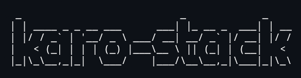

---

# karo-stack

**Create declarative Linux servers and desktops**

> [!WARNING]  
> This project is currently in early development, and is not yet ready for public use.

## Copyright & License

The [karo-stack](https://github.com/hazzuk/karo-stack) project is copyright © [hazzuk](https://github.com/hazzuk) and is licensed [AGPL-3.0-only](https://github.com/hazzuk/karo-stack/blob/main/LICENSE).
